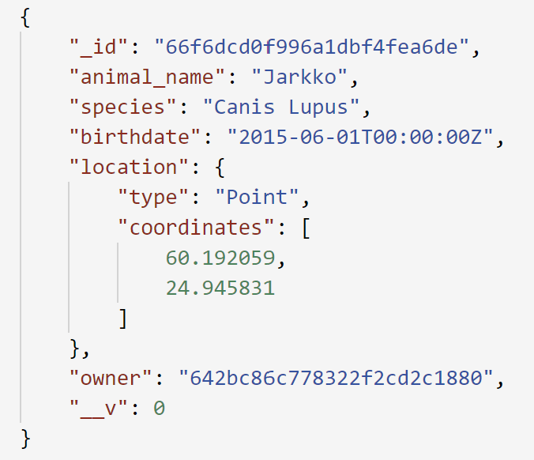
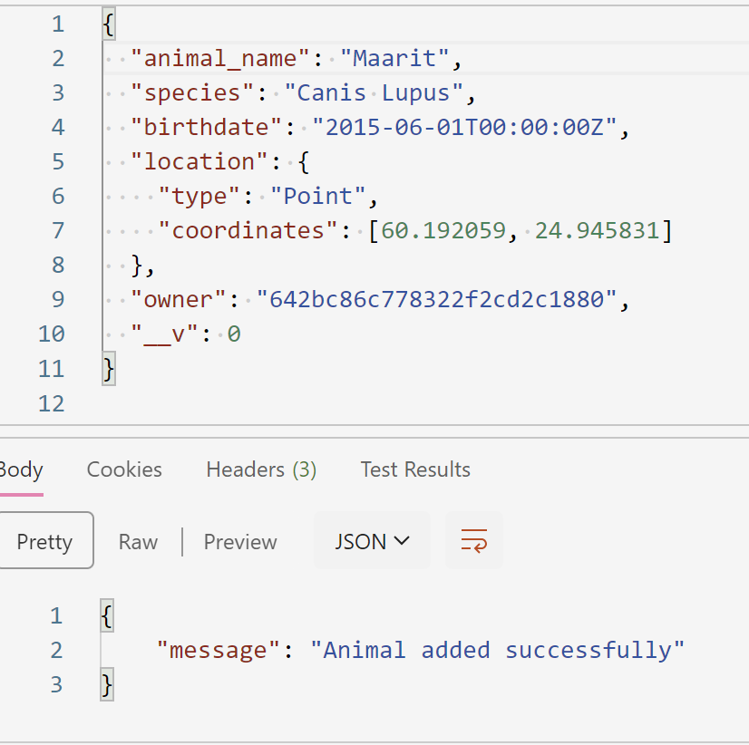
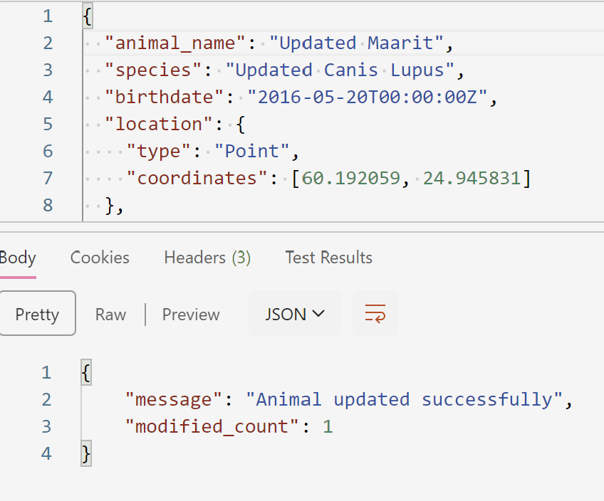
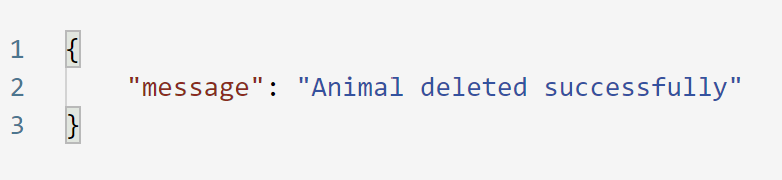

# Go Assignment

Animal API made with Go with data stored in MongoDB. Basic CRUD operations implemented.

## API Specification

```yaml

openapi: 3.0.0
info:
  title: Animal Management API
  description: An API for managing animals with MongoDB as the backend. You can get, create, update, and delete animal data.
  version: 1.0.0
servers:
  - url: http://localhost:5000/api
    description: Local development server
paths:
  /animals:
    get:
      summary: Get all animals
      description: Retrieves a list of all animals stored in the database.
      responses:
        '200':
          description: A list of animals.
          content:
            application/json:
              schema:
                type: array
                items:
                  $ref: '#/components/schemas/Animal'
        '500':
          description: Server error
    post:
      summary: Create a new animal
      description: Adds a new animal to the database.
      requestBody:
        required: true
        content:
          application/json:
            schema:
              $ref: '#/components/schemas/Animal'
      responses:
        '201':
          description: Animal created successfully
          content:
            application/json:
              schema:
                type: object
                properties:
                  message:
                    type: string
                    example: Animal added successfully
        '400':
          description: Invalid input or validation error
        '500':
          description: Server error

  /animals/{id}:
    put:
      summary: Update an animal
      description: Updates the details of an existing animal in the database.
      parameters:
        - in: path
          name: id
          schema:
            type: string
          required: true
          description: The ID of the animal to update.
      requestBody:
        required: true
        content:
          application/json:
            schema:
              $ref: '#/components/schemas/Animal'
      responses:
        '200':
          description: Animal updated successfully
          content:
            application/json:
              schema:
                type: object
                properties:
                  message:
                    type: string
                    example: Animal updated successfully
                  modified_count:
                    type: integer
                    example: 1
        '400':
          description: Invalid input or animal ID
        '404':
          description: Animal not found
        '500':
          description: Server error
    delete:
      summary: Delete an animal
      description: Deletes an existing animal from the database.
      parameters:
        - in: path
          name: id
          schema:
            type: string
          required: true
          description: The ID of the animal to delete.
      responses:
        '200':
          description: Animal deleted successfully
          content:
            application/json:
              schema:
                type: object
                properties:
                  message:
                    type: string
                    example: Animal deleted successfully
        '400':
          description: Invalid animal ID
        '500':
          description: Server error

components:
  schemas:
    Animal:
      type: object
      properties:
        _id:
          type: string
          description: Unique identifier for the animal
        animal_name:
          type: string
          description: The name of the animal
        species:
          type: string
          description: The species of the animal
        birthdate:
          type: string
          format: date
          description: The birth date of the animal
        location:
          type: object
          properties:
            type:
              type: string
              description: Type of the location (e.g., Point)
              example: Point
            coordinates:
              type: array
              items:
                type: number
              description: Geographical coordinates (latitude, longitude)
              example: [24.93545, 60.16952]
        owner:
          type: string
          description: The owner of the animal
        __v:
          type: integer
          description: Document version
      required:
        - animal_name
        - species
        - birthdate
        - location
        - owner
```

## Examples of operations:

## GET



## POST



## PUT



## DELETE


